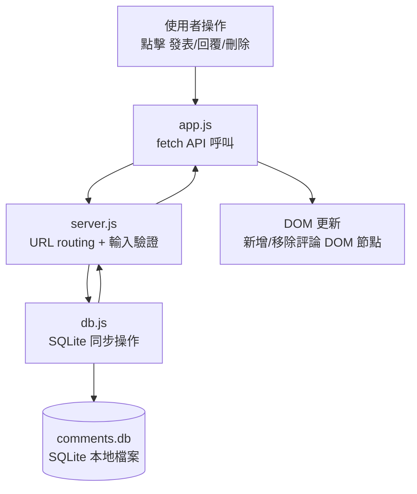
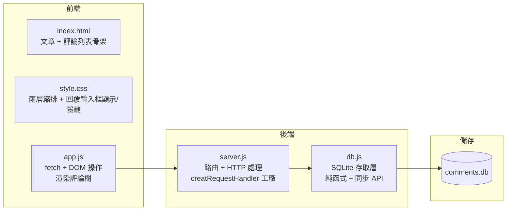

# user-comments - Task 3

Execute task 3 for the user-comments specification.

## Task Description
實作 DB 讀取函式

## Code Reuse
**Leverage existing code**: user-comments/db.js（Task 2 建立的 createDatabase）

## Requirements Reference
**Requirements**: 需求 2 AC1（升冪排列）、需求 2 AC3（空陣列）

## Usage
```
/Task:3-user-comments
```

## Instructions

Execute with @spec-task-executor agent the following task: "實作 DB 讀取函式"

```
Use the @spec-task-executor agent to implement task 3: "實作 DB 讀取函式" for the user-comments specification and include all the below context.

# Steering Context
## Steering Documents Context

No steering documents found or all are empty.

# Specification Context
## Specification Context (Pre-loaded): user-comments

### Requirements
# 需求文件：使用者評論系統

## 簡介

使用者可以對法語學習文章發表評論，並可回覆其他人的評論，形成討論串（兩層巢狀）。本功能為 French Learning App 的社群互動層，透過討論促進學習成效。

**範圍假設（本版 MVP）**：

- 本應用為單人本機工具（無使用者帳號系統），任何使用者皆可發表與刪除評論
- 評論不保留作者資訊（匿名模式）
- 不實作速率限制（本機工具無此需求）
- 不實作分頁（MVP 範圍內評論數量有限）

## 與產品願景的對齊

本功能支援法語學習者之間的知識交流：學習者可以在文章下方提問、分享記憶法、更正彼此的法語拼寫，形成輕量級的同儕互助機制。

---

## 需求

### 需求 1：發表頂層評論

**User Story：** 身為學習者，我想在文章下方發表評論，以便分享想法或提問。

#### 驗收標準

1. WHEN 使用者在評論輸入框輸入文字並送出 THEN 系統 SHALL 將評論儲存並立即顯示於文章下方的評論清單最底部
2. WHEN 使用者送出空白評論（純空白字元） THEN 系統 SHALL 顯示錯誤訊息「評論內容不可為空白」並不儲存
3. WHEN 評論內容超過 500 字元 THEN 系統 SHALL 顯示錯誤訊息「評論不可超過 500 字元」並不儲存
4. WHEN 評論送出成功 THEN 系統 SHALL 清空輸入框並顯示新評論（含發表時間，格式：YYYY-MM-DD HH:MM）
5. IF 文章不存在 THEN 系統 SHALL 回傳 404 並顯示錯誤訊息「文章不存在」

---

### 需求 2：查看文章的所有評論

**User Story：** 身為學習者，我想查看某篇文章下的所有評論與回覆，以便閱讀他人的討論。

#### 驗收標準

1. WHEN 使用者開啟文章頁面 THEN 系統 SHALL 顯示該文章的所有頂層評論，依發表時間升冪排列（最舊的在最上方）
2. WHEN 頂層評論有回覆 THEN 系統 SHALL 在該評論下方縮排顯示所有回覆，依回覆時間升冪排列
3. IF 文章沒有任何評論 THEN 系統 SHALL 顯示「尚無評論，來發表第一則吧！」
4. WHEN 頁面載入 THEN 系統 SHALL 顯示每則評論的內容與發表時間（格式：YYYY-MM-DD HH:MM）

---

### 需求 3：回覆他人的評論

**User Story：** 身為學習者，我想回覆特定評論，以便針對該則討論進行回應。

#### 驗收標準

1. WHEN 使用者點擊評論的「回覆」按鈕 THEN 系統 SHALL 在該評論下方顯示回覆輸入框
2. WHEN 使用者在回覆輸入框輸入文字並送出 THEN 系統 SHALL 將回覆儲存並立即顯示於原評論下方
3. WHEN 使用者送出空白回覆 THEN 系統 SHALL 顯示錯誤訊息「回覆內容不可為空白」並不儲存
4. WHEN 回覆內容超過 500 字元 THEN 系統 SHALL 顯示錯誤訊息「回覆不可超過 500 字元」並不儲存
5. WHEN 使用者點擊「取消」 THEN 系統 SHALL 隱藏回覆輸入框並清空其內容
6. IF 被回覆的評論不存在 THEN 系統 SHALL 回傳 404 並顯示錯誤訊息「原評論不存在」
7. WHEN 評論屬於回覆層級（parent_id 不為 null） THEN 系統 SHALL 不顯示「回覆」按鈕（僅支援兩層評論）

---

### 需求 4：刪除評論

**User Story：** 身為學習者，我想刪除自己發表的評論，以便更正錯誤或移除不再需要的內容。

#### 驗收標準

1. WHEN 使用者點擊評論的「刪除」按鈕 THEN 系統 SHALL 移除該評論並立即從畫面上消失
2. WHEN 頂層評論被刪除且有回覆 THEN 系統 SHALL 一併刪除所有子回覆（CASCADE DELETE）
3. IF 評論不存在 THEN 系統 SHALL 回傳 404 並顯示錯誤訊息「評論不存在」
4. IF 評論 ID 非整數 THEN 系統 SHALL 回傳 400 並顯示錯誤訊息「無效的評論 ID」

---

## 非功能性需求

### 效能

- API 回應時間 < 100ms（本機 SQLite，單一使用者場景）
- 頁面載入後評論清單顯示 < 500ms

### 安全性

- 所有資料庫操作使用參數化查詢（防 SQL Injection）
- 評論內容以純文字儲存，前端顯示時使用 `textContent`（防 XSS）
- 不洩漏伺服器內部錯誤細節給前端

### 可靠性

- 資料庫操作失敗時回傳 500 並記錄錯誤至 console.error
- 送出評論失敗時顯示錯誤訊息，不清空使用者已輸入的內容

### 易用性

- 回覆輸入框在點擊「回覆」後自動獲得 focus
- 送出按鈕在輸入框為空時為 disabled 狀態
- 刪除操作不需二次確認（簡單工具類功能）

---

### Design
# 設計文件：使用者評論系統

## 概覽

本功能讓使用者可以在法語學習文章下方發表評論，並回覆他人的評論（最多兩層巢狀）。架構與現有 `countdown-timer` 功能完全一致：純原生 HTML/CSS/JS 前端 + Node.js `node:http` 後端 + `node:sqlite` 本地資料庫，零外部 npm 依賴。

---

## 技術標準對齊

### 零 npm 依賴原則

所有模組使用 Node.js 22+ 內建模組：`node:http`、`node:sqlite`、`node:fs`、`node:path`、`node:url`、`node:test`、`node:assert`。

### 專案結構慣例

沿用 `countdown-timer/` 的扁平結構：一個功能目錄包含 5 個源碼檔案 + `tests/` 子目錄。

---

## 程式碼複用分析

### 沿用既有模式（不另外 import，各自維護）

| 模式 | 來源 | 本功能做法 |
|------|------|----------|
| `createRequestHandler(db)` 工廠 | `countdown-timer/server.js:121` | 完全沿用：讓測試注入 `:memory:` DB |
| `readBody(req)` 輔助函式 | `countdown-timer/server.js:66` | 複製到本功能的 `server.js` |
| `sendJson(res, status, data)` 輔助函式 | `countdown-timer/server.js:88` | 複製到本功能的 `server.js` |
| `DatabaseSync` 同步 API + 參數化查詢 | `countdown-timer/db.js:8` | 沿用相同模式 |
| 正規表達式 URL 匹配 | `countdown-timer/server.js:161` | 沿用：`pathname.match(/pattern/)` |
| 驗證在 DB 層拋 Error | `countdown-timer/db.js:46` | 沿用：server 層統一 catch |
| `node:test` + `node:assert` | `countdown-timer/tests/` | 沿用相同測試框架 |

### 整合點

- **獨立功能目錄**：`user-comments/`，不修改 `countdown-timer/` 的任何檔案
- **伺服器 port**：使用 `3001`（避免與 countdown-timer:3000 衝突）

---

## 架構

### 資料流



### 元件層次



---

## 元件與介面

### `db.js`

- **用途**：封裝所有 SQLite 操作，包含資料庫初始化、CRUD 函式與資料驗證
- **介面**：

```javascript
// 建立並初始化 DB（articles + comments 兩張表）
// 重要：執行 PRAGMA foreign_keys = ON 以啟用 CASCADE DELETE
// 插入 3 筆種子文章（使用 INSERT OR IGNORE 避免重複）
export function createDatabase(dbPath)

// 取得所有文章（用於首頁選單）
export function getAllArticles(db)

// 取得單一文章（驗證存在性），不存在回傳 undefined
export function getArticleById(db, articleId)

// 取得文章的所有評論，依 created_at ASC 排序（最舊在前）
// 回傳 Array<{ id, article_id, parent_id, content, created_at }>
// server.js 負責將平坦陣列組裝成巢狀 { replies: [] } 結構
export function getCommentsByArticle(db, articleId)

// 新增評論或回覆
// parentId 為 null 表示頂層評論；為整數表示回覆對象
// 驗證規則（拋出 Error）：
//   - content trim 後為空 → "評論內容不可為空白"（頂層）/ "回覆內容不可為空白"（回覆）
//   - content.length > 500 → "評論不可超過 500 字元"（頂層）/ "回覆不可超過 500 字元"（回覆）
//   - articleId 不存在 → "文章不存在"
//   - parentId 不存在 → "原評論不存在"
//   - parentId 的 parent_id 非 null（三層巢狀）→ "不支援對回覆再次回覆"（400）
export function addComment(db, articleId, content, parentId)

// 刪除評論（因 PRAGMA foreign_keys = ON，子回覆自動 CASCADE 刪除）
// 回傳 boolean：true 表示有刪除，false 表示 id 不存在
export function deleteComment(db, commentId)
```

- **依賴**：`node:sqlite`

---

### `server.js`

- **用途**：HTTP 路由與回應，綁定 DB 實例
- **介面**：

```javascript
export function createRequestHandler(db)  // 供測試注入 :memory: DB
```

- **API 端點**：

| 方法 | 路徑 | 說明 |
|------|------|------|
| `GET` | `/api/articles` | 取得所有文章清單 |
| `GET` | `/api/articles/:id/comments` | 取得文章的所有評論與回覆 |
| `POST` | `/api/articles/:id/comments` | 新增評論或回覆（body: `{ content, parent_id? }`） |
| `DELETE` | `/api/comments/:id` | 刪除評論（含子回覆） |
| `GET` | `/` | 回傳 `index.html` |
| `GET` | `/style.css` | 回傳樣式表 |
| `GET` | `/app.js` | 回傳前端 JS |

- **依賴**：`node:http`、`node:fs`、`node:path`、`node:url`、`db.js`

---

### `app.js`

- **用途**：前端邏輯，呼叫 API 並操作 DOM
- **核心函式**：

```javascript
async function loadComments(articleId)   // GET /api/articles/:id/comments → 渲染
async function submitComment(articleId, content, parentId)  // POST
async function deleteComment(commentId)  // DELETE
function renderComments(comments)        // 將評論陣列渲染成 DOM 樹（兩層）
function showReplyForm(commentId)        // 顯示回覆輸入框並 focus
function hideReplyForm(commentId)        // 隱藏並清空回覆輸入框
```

- **依賴**：瀏覽器原生 `fetch`、DOM API

---

## 資料模型

### `articles` 資料表

```sql
CREATE TABLE IF NOT EXISTS articles (
  id         INTEGER PRIMARY KEY AUTOINCREMENT,
  title      TEXT    NOT NULL,
  content    TEXT    NOT NULL,
  created_at TEXT    NOT NULL
);
```

種子資料（3 篇法語學習文章，`createDatabase` 時自動插入）：

- `Les salutations`（問候語）
- `Les nombres 1-20`（數字 1-20）
- `Les couleurs`（顏色）

### `comments` 資料表

```sql
CREATE TABLE IF NOT EXISTS comments (
  id         INTEGER PRIMARY KEY AUTOINCREMENT,
  article_id INTEGER NOT NULL,
  parent_id  INTEGER,
  content    TEXT    NOT NULL CHECK(length(trim(content)) > 0 AND length(content) <= 500),
  created_at TEXT    NOT NULL,
  FOREIGN KEY (article_id) REFERENCES articles(id),
  FOREIGN KEY (parent_id)  REFERENCES comments(id) ON DELETE CASCADE
);
```

> **注意**：SQLite 外鍵約束預設不啟用。`createDatabase` 必須在建表前執行 `PRAGMA foreign_keys = ON;`，CASCADE DELETE 才會生效。

**`created_at` 格式**：由伺服器端產生，格式為 `"YYYY-MM-DD HH:MM"`（本機時間）：

```javascript
const created_at = new Date().toLocaleString("sv-SE").slice(0, 16); // "2026-06-28 10:00"
```

| 欄位 | 型別 | 說明 |
|------|------|------|
| `id` | INTEGER | 自動遞增主鍵 |
| `article_id` | INTEGER NOT NULL | 所屬文章 |
| `parent_id` | INTEGER NULL | NULL = 頂層評論；非 null = 回覆（最多兩層） |
| `content` | TEXT NOT NULL | 評論內容（trim 後 1–500 字元） |
| `created_at` | TEXT NOT NULL | 建立時間（ISO 8601 精度到分鐘） |

### API 回應格式（`GET /api/articles/:id/comments`）

```json
[
  {
    "id": 1,
    "article_id": 1,
    "parent_id": null,
    "content": "這篇文章很有幫助！",
    "created_at": "2026-06-28 10:00",
    "replies": [
      {
        "id": 3,
        "article_id": 1,
        "parent_id": 1,
        "content": "同意！我也覺得範例很清楚。",
        "created_at": "2026-06-28 10:05",
        "replies": []
      }
    ]
  }
]
```

> 巢狀結構由 `server.js` 在 API 回應前動態組裝（`parent_id` 分群），不額外儲存。

---

## 錯誤處理

### 錯誤情境

1. **頂層評論內容為空白**
   - **處理**：DB 層驗證，拋出 `Error("評論內容不可為空白")`，server 層回傳 400
   - **使用者體驗**：輸入框下方顯示錯誤訊息，輸入框不清空

2. **回覆內容為空白**
   - **處理**：DB 層驗證，拋出 `Error("回覆內容不可為空白")`，server 層回傳 400
   - **使用者體驗**：回覆輸入框下方顯示錯誤訊息，輸入框不清空

3. **頂層評論超過 500 字元**
   - **處理**：DB 層驗證，拋出 `Error("評論不可超過 500 字元")`，server 層回傳 400
   - **使用者體驗**：輸入框下方顯示錯誤訊息

4. **回覆超過 500 字元**
   - **處理**：DB 層驗證，拋出 `Error("回覆不可超過 500 字元")`，server 層回傳 400
   - **使用者體驗**：回覆輸入框下方顯示錯誤訊息

5. **文章不存在（article_id 無效）**
   - **處理**：`getArticleById` 回傳 undefined，server 層回傳 404 `{ "error": "文章不存在" }`
   - **使用者體驗**：顯示錯誤訊息

6. **被回覆的評論不存在（parent_id 無效）**
   - **處理**：DB 層查詢 parent_id 不存在，拋出 `Error("原評論不存在")`，server 層回傳 404 `{ "error": "原評論不存在" }`
   - **使用者體驗**：回覆輸入框下方顯示錯誤訊息

7. **嘗試對回覆再次回覆（三層巢狀）**
   - **處理**：DB 層驗證 parent 的 `parent_id` 非 null，拋出 `Error("不支援對回覆再次回覆")`，server 層回傳 400
   - **使用者體驗**：前端不顯示回覆按鈕（回覆層）；後端作為額外防線

8. **評論不存在（delete 找不到 id）**
   - **處理**：`deleteComment` 回傳 false，server 層回傳 404 `{ "error": "評論不存在" }`
   - **使用者體驗**：顯示錯誤訊息

9. **無效的評論 ID（非整數）**
   - **處理**：server 層驗證，直接回傳 400 `{ "error": "無效的評論 ID" }`

10. **DB 操作失敗（非預期錯誤）**
    - **處理**：外層 try/catch，`console.error`，回傳 500 `{ "error": "伺服器錯誤，請稍後再試" }`

### 前端安全與 UX 設計

- **XSS 防禦**：`renderComments` 使用 `element.textContent = comment.content`（而非 `innerHTML`），確保評論內容不被解析為 HTML
- **空狀態**：`renderComments` 收到空陣列時，顯示 `<p class="empty-state">尚無評論，來發表第一則吧！</p>`
- **送出按鈕 disabled**：`<textarea>` 的 `input` 事件監聽器即時更新送出按鈕的 `disabled` 狀態（內容去空白後為空則 disabled）
- **回覆層不顯示回覆按鈕**：`renderComments` 在渲染回覆（`parent_id !== null`）時不產生回覆按鈕 DOM 節點

---

## 測試策略

### 單元測試（`tests/db.test.js`）

- `createDatabase`：確認兩張資料表被建立、種子文章被插入
- `addComment`：happy path（頂層）、happy path（回覆）、空白內容拒絕、超過 500 字元拒絕、article_id 不存在拒絕、parent_id 為回覆層拒絕（防止三層巢狀）
- `getCommentsByArticle`：無評論回傳空陣列、有頂層評論、有回覆
- `deleteComment`：刪除頂層同時刪子回覆、刪除不存在 id 回傳 false

### 整合測試（`tests/api.test.js`）

- `GET /api/articles`：回傳種子文章
- `GET /api/articles/:id/comments`：回傳巢狀結構
- `POST /api/articles/:id/comments`：新增頂層評論（201）、新增回覆（201）、空白頂層（400）、空白回覆（400）、超500字（400）、文章不存在（404）、parent_id 不存在（404）、嘗試三層巢狀（400）
- `DELETE /api/comments/:id`：刪除頂層成功且子回覆被 CASCADE 刪除（200）、id 不存在（404）、id 非整數（400）

### 測試工具

`node:test` + `node:assert`（Node.js 22+ 內建，零依賴）

**Note**: Specification documents have been pre-loaded. Do not use get-content to fetch them again.

## Task Details
- Task ID: 3
- Description: 實作 DB 讀取函式
- Leverage: user-comments/db.js（Task 2 建立的 createDatabase）
- Requirements: 需求 2 AC1（升冪排列）、需求 2 AC3（空陣列）

## Instructions
- Implement ONLY task 3: "實作 DB 讀取函式"
- Follow all project conventions and leverage existing code
- Mark the task as complete using: claude-code-spec-workflow get-tasks user-comments 3 --mode complete
- Provide a completion summary
```

## Task Completion
When the task is complete, mark it as done:
```bash
claude-code-spec-workflow get-tasks user-comments 3 --mode complete
```

## Next Steps
After task completion, you can:
- Execute the next task using /user-comments-task-[next-id]
- Check overall progress with /spec-status user-comments
